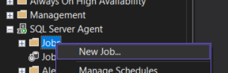

# Plan održavanja - rješenje

---

# 1. SQL Server Agent

- zadužen za periodično izvršavanje određenog zadatka nad instancom SQL Servera
- izvršava **poslove** (engl. *jobs*)
    - svaki posao se sastoji od jednog ili više **koraka**

# 2. Kreiranje posla (job)



## 2.1 Postavke posla

- svaki posao ima svojeg *Ownera*, odnosno izvršava se preko određenog korisničkog računa
- odabrani Owner mora imati dovoljna prava za izvršavanje danog posla


## 2.2 Definiranje koraka (engl. *steps*)

- primjer koraka:


## 2.3 Raspored izvršavanja poslova (Schedule)


# 3. Nadgledanje izvršavanja

### 3.1 Job Activity Monitor


# 4. Backup posao (SQL skripta za backup)

- odemo na `miabp_db` > `Tasks`>`Back up...`
- postavimo vrstu backupa i odaberemo `Script` kako bi generirali SQL skriptu backupa


- u dobivenoj skripti promijenimo naziv novog .bak filea da sadrži vrijeme backupa
    - `'..\miabp_db_tl_', **CAST(GETDATE() AS DATE)**, '.bak'` → ‘tl’ za *Transaction Log* backup

```sql
BEGIN
	DECLARE @path VARCHAR(255) = CONCAT('C:\Program Files\Microsoft SQL Server\MSSQL15.MSSQLSERVER2\MSSQL\Backup\miabp_db_tl_', CAST(GETDATE() AS DATE), '.bak');
	BACKUP LOG [miabp_db] TO  DISK = @path WITH NOFORMAT, NOINIT,  NAME = N'miabp_db-backup', SKIP, NOREWIND, NOUNLOAD,  STATS = 10
END
GO
```

- dobiveni kod koristimo kao ‘Step’ u izvršavanju posla