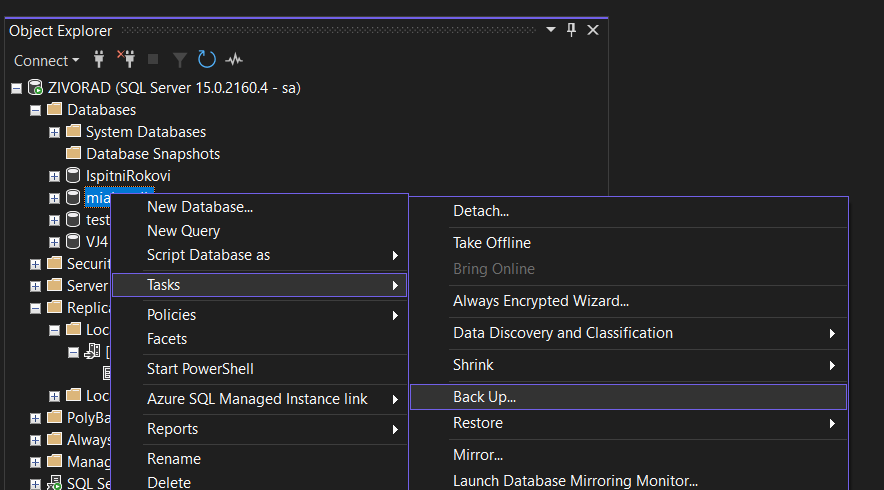

# Povrat (restore) - rješenje

---

```sql
-- DEMO

select * from "Io".Folder;
select * from "Io".Note;

-- FULL Backup

delete from "Io".Folder where id = 13;

-- Transaciton Log Backup - 1

insert into "Io".Note (name, content, folderId) values ('Test note', 'Content of this test note', 8);

-- Transaction Log Backup - 2

insert into "Io".Folder (name, parentFolderId) values ('Test folder', 8);
```

# 1. Izrada rezervne kopije (backup) baze podataka

---

#### 1. Pronalazak opcije izrade rezervne kopije

- desni klik na bazu podataka koju želimo kopirati




#### 2. Odabir vrste rezervne kopije

- vrste kopija:
    - **potpuna**
    - **diferencijalna**
    - **dnevnika transakcija**


#### 3. Odabir lokacije za pohranu kopije

- dobra je praksa napraviti zaseban file za svaki novi backup
    
    
    
- u primjeru dolje su napravljeni redom:
    1. full backup
    2. transaction log backup (1)
    3. transaction log backup (2)
    4. differential backup


#### 4. Dodatne postavke

- u **Media Options** je dobra praksa označiti *Verify backup* i *Perform* c*hecksum*


# 2. Povrat baze podataka


#### 1. Odabir backup seta


- Setovi su poredani od najstarijeg do najnovijeg
- Differential backup overridea i briše transaction log backupove
- Novi full backup briše differential i transaction log backupove

#### 2. Restore u određenu točku u vremenu


#### 3. Dodatne postavke


- dobra je praksa čekirati “Close existing connections to destination database”