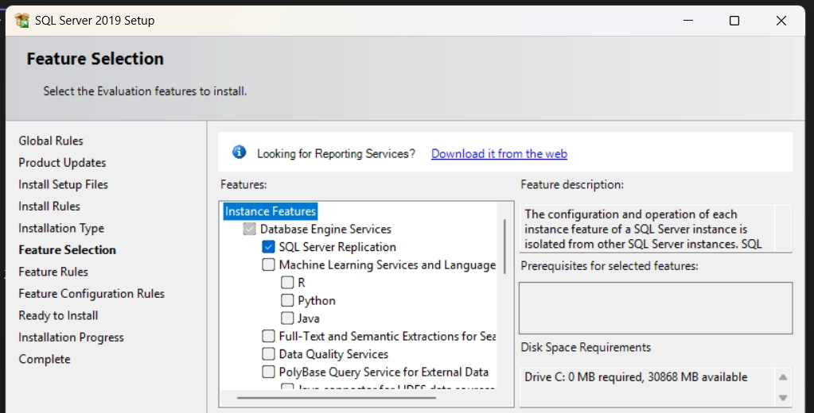
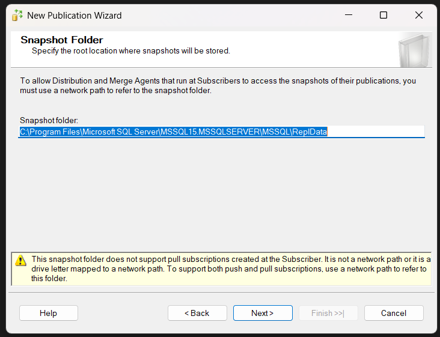
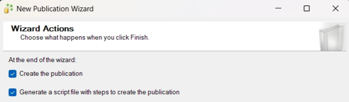
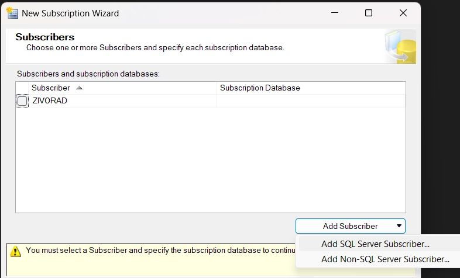
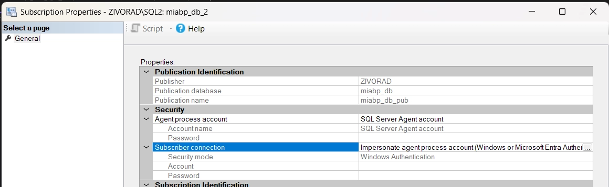

# Replikacija - rješenje

---

<aside>

https://www.youtube.com/watch?v=1Qdl4qWl_Dw

</aside>

# 1. Preduvjeti

---

#### 1. **Instalacija** još jedne instance SQL Servera (u slučaju da nedostaje) na koju će se replicirati izvorna baza

#### 2. Na izvornoj SQL instanci instalirati (ako nedostaje): **SQL Server Replication**



# 2. Kreiranje publikacije

---

#### 1. Kreiranje nove **Public Replikacije** (na izvornoj SQL instanci):

- `SQL instanca` > `Replication` > `Local Publications` > `<desni klik>` > `New Publication`

#### 2. Odabrati lokaciju za pohranu **Snapshot** replikacije (GREŠKA 1)

- **!! GREŠKA 1** [Rješenje:](#greška-1-access-to-path-is-denied-for-snapshot-agent)



#### 3. Odabir baze koja će se replicirati

#### 4. Odabir vrste publikacije

- zadatak traži **Transakcijsku replikaciju**


#### 5. Odabir artikala koji će se replicirati


#### 6. Filtriranje podataka koji će se replicirati _(preskočeno, svi podaci se repliciraju)_

#### 7. Vrijeme izvršavanja replikacije


#### 8. Snapshot Agent account

- inače je loša praksa koristiti **SQL Server Agent account** (ima previše prava) **→** bolje bi bilo napraviti account koji ima minimalna potrebna prava


#### 9. Generiranje publikacijske skripte



- odabir lokacije gdje se sprema skripta


#### 10. Imenovanje publikacije i informacije o izvođenju publikacije


- Izvođenje publikacije
    <aside>
    
    - Create the publication.
    - Create a script file named `C:\Users\2001m\Documents\CreatePublication.sql` with steps to create the publication.
    
    **The Publisher 'ZIVORAD' will be configured with the following options:**
    
    - The Publisher will act as its own Distributor.
    - Use `C:\Program Files\Microsoft SQL Server\MSSQL15.MSSQLSERVER\MSSQL\ReplData` as the root snapshot folder for Publishers using this Distributor.
    
    **A publication will be created with the following options:**
    
    - Create a transactional publication from database 'miabp_db'.
    - The Snapshot Agent process will run under the 'SQL Server Agent service' account.
    - The Log Reader Agent process will run under the 'SQL Server Agent service' account.
    - The publication compatibility level will support Subscribers that are servers running SQL Server 2008 or later.
    - Publish the following tables as articles:
        - 'Folder'
        - 'Group'
        - 'GroupUser'
        - 'LoggedReminder'
        - 'Note'
        - 'Organisation'
        - 'Permission'
        - 'Reminder'
        - 'sysdiagrams'
        - 'Tag'
        - 'TaggedNote'
        - 'User'
    - Create a snapshot of this publication immediately after the publication is created.
    </aside>

#### 11. Izvršenje publikacije ✅


Novo kreirana publikacija

# 3. Kreiranje pretplate (engl. _subscription_)

---

#### 1. Kreiranje nove pretplate

- desni klik na novo kreiranu publikaciju:


#### 2. Odabir publikacije


#### 3. Način distribucije (_push/pull_)


#### 4. Odabir pretplatnika




#### 5. Distribution Agent (GREŠKA 2)

- **!! GREŠKA.** [Rješenje](#greška-2-subscriber-connection)


#### 6. Sinkronizacija


#### 7. Iniciranje pretplate


#### 8. Generiranje skripte


#### 9. Informacije o izvođenju


<aside>

# ⁉️ Greške i popravci

---

## Greška 1: Access to path is Denied for Snapshot Agent

<aside>

- Objašnjenje _ChatGPT_ ## 🧠 What this means

      The **Snapshot Agent cannot write to the snapshot folder**, so:

      1. Snapshot generation **fails immediately**
      2. The job **fails**
      3. **SQL Server Agent suspends the job**
      4. You then get:

          > *“job has been suspended” (Error 22022)*
          >

      ---

      ## ✅ Solution

      Instead of using `Program Files`, use something like:

      `C:\ReplData`

      Then:

      1. Update snapshot folder in:
          - Replication → Publisher Properties
      2. Give proper permissions to the agent account

      👉 This avoids Windows security restrictions entirely

      1. Restart **SQL Server Agent**
      2. Enable the job
      3. Start job → **Step 1**

  </aside>

_Snapshot Agent_ nije imao prava pisanja u zadani folder.


Trebalo je kreirati novi folder `C:\SQL_replication_data` i zadati prava pisanja korisnicima. Zatim je trebalo u _Publication Properties_ publikacije zadati putanju na novo kreirani folder.


Nakon toga je bilo potrebno restartati _SQL Server Agent_ i ponovno ga upaliti.

## Greška 2: Subscriber connection

<aside>

- Objašnjenje _ChatGPT_
    <aside>
    
    The **Distribution Agent** is trying to connect to the **Subscriber**, but:
    
    👉 It is using the account:
    
    `NT Service\SQLSERVERAGENT`
    
    👉 And that account **does NOT have permission on the Subscriber instance**
    
    ---
    
    ## 🚫 Why your current setup fails
    
    `NT Service\SQLSERVERAGENT`
    
    - This is a **local service account**
    - It **does NOT exist on another SQL Server instance**
    - So the Subscriber rejects it → **Error 18456**
    
    ---
    
    ## ✅ Solution
    
    **Use SQL Server Authentication**
    
    1. Select:
    👉 *“Use SQL Server Authentication”*
    2. Enter:
        
        ```
        Login: sa
        Password: ****
        ```
        
    3. Click **OK**
    4. Go to:
        - Replication Monitor or Job
    5. Restart the Distribution Agent
    </aside>

</aside>

_Distribution Agent_ nije imao dostatna prava. Trebalo je na pretplatniku promijeniti s _Impersonate agent process account_ na _SQL Server Authentication_.



Kriva postavka


Ispravna postavka

</aside>
